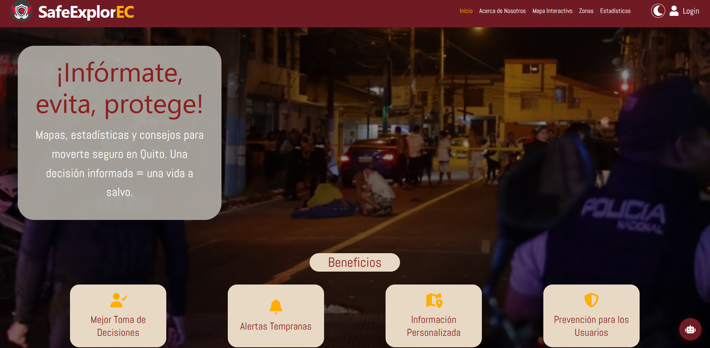
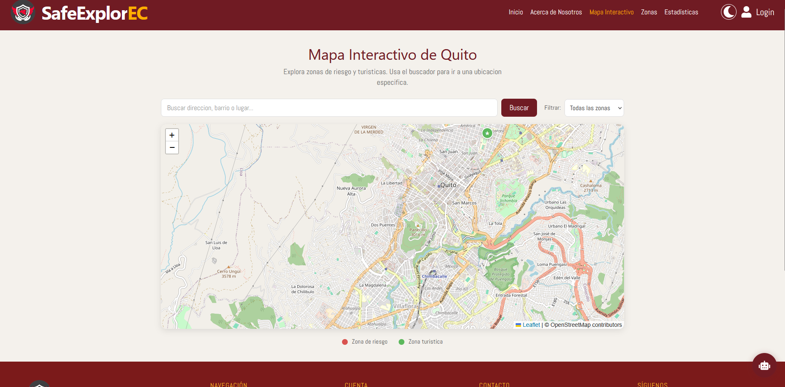
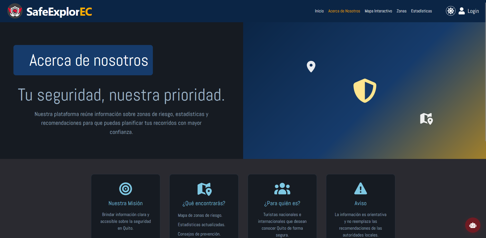

# SafeExplorEC


Plataforma web para consultar zonas turísticas y zonas de riesgo en Quito, Ecuador.

Versión: 1.0.0

## Aplicación

La aplicación se encuentra publicada en:

[Visitar SafeExplorEC](https://safeexplorec.web.app/)

---

## Descripción

SafeExplorEC es una aplicación web que busca ayudar a turistas y residentes a conocer diferentes lugares de Quito.

La plataforma permite visualizar zonas turísticas y zonas de riesgo mediante un mapa interactivo, además de consultar información importante sobre cada lugar.

---

## Funcionalidades

- Visualización de zonas turísticas.
- Visualización de zonas de riesgo.
- Mapa interactivo de Quito.
- Registro e inicio de sesión.
- Administración del perfil del usuario.
- Envío de quejas y sugerencias.
- Administración de zonas.
- Visualización de estadísticas.
- Chatbot de ayuda.
- Diseño adaptable a computadoras y dispositivos móviles.

---

## Tecnologías utilizadas

- React
- Vite
- Firebase Authentication
- Cloud Firestore
- Firebase Hosting
- Leaflet
- Chart.js
- Git y GitHub
- GitHub Actions

---

## Instalación

### 1. Clonar el repositorio

```bash
git clone https://github.com/diego281010/SafeExplorEC.git
```

### 2. Entrar al proyecto

```bash
cd SafeExplorEC
```

### 3. Instalar las dependencias

```bash
npm install
```

### 4. Ejecutar la aplicación

```bash
npm run dev
```

---

## Capturas

### Página principal



### Mapa interactivo



### Acerca de nosotros



---

## Integrantes

- Diego Almeida
- Nicolay Barreno
- Alejandro Aguirre
- Briander Verdezoto

---

## Mejoras futuras

- Mostrar zonas cercanas al usuario.
- Agregar más filtros de búsqueda.
- Crear una aplicación en base de la página web.
- Mejorar la accesibilidad de la aplicación.
- Ampliar las pruebas automatizadas.